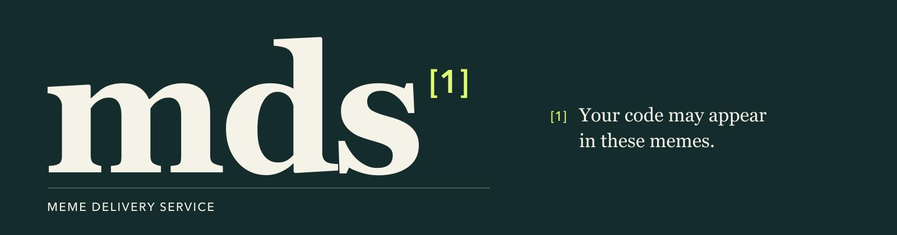
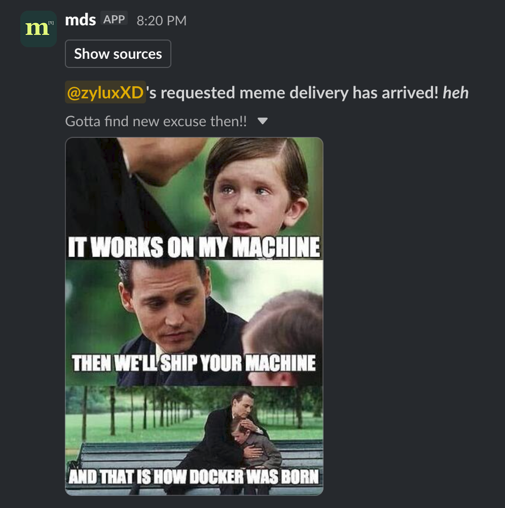

# MDS

**MDS** (Meme Delivery Service) is a Slack bot that delivers memes from [ProgrammerHumor](https://programmerhumor.io/).



It can post a daily batch automatically, or fetch memes whenever someone uses `/memes`. It sorts memes by views and can
use an LLM to moderate them.

## Try it

<a href="assets/demo.png">
  
</a>

Firstly, use the [installation guide](#install) to get an MDS instance up and running!

In a channel where MDS is running and added, request a small batch:

```text
/memes 3 hot
```

The memes appear in the channel, followed by a **Show sources** button. Click it to see where the memes came from
and, when available, jump back to the uploaded post. Only you can see the source reply.

___

## What it does

- Posts up to 10 memes daily at a UTC time you choose.
- Lets you request 1-10 memes using `/memes`, with home, hot, random, and search sources (derived from ProgrammerHumor).
- Uploads the images to Slack with a randomly chosen accompanying comment.
- Has a **Show sources** button so you can find the original memes directly from ProgrammerHumor.
- Can use an LLM to check the memes before posting, with separate controls for daily posts and `/memes`.
- Lets you trigger a post from the terminal to the set Slack channel, even when automatic daily posting is turned off.

___

## Install

Requires **Python 3.14 or newer**. MDS uses [uv](https://docs.astral.sh/uv/getting-started/installation/) for installing
dependencies!

### Slack setup

MDS uses Slack [Socket Mode](https://docs.slack.dev/apis/events-api/using-socket-mode/), so you don't need any extra
setup.
You do need to keep the bot running to receive commands obviously!

1. [Create a Slack app](https://api.slack.com/apps) for your workspace and enable **Socket Mode**.
2. Create an app-level token with [`connections:write`](https://docs.slack.dev/reference/scopes/connections.write/).
   This goes in `SLACK_APP_TOKEN`.
3. Under **OAuth & Permissions**, add these bot scopes:
    - `chat:write` to post messages.
    - `files:write` & `files:read` to upload memes and find
      the uploaded message for the source button's link.
    - [`commands`](https://docs.slack.dev/reference/scopes/commands/) for `/memes`.
4. Under **Slash Commands**, create `/memes`. Turn on [
   **Interactivity**](https://docs.slack.dev/interactivity/handling-user-interaction/)
   under **Interactivity & Shortcuts** so the source button works.
5. Install the app to your workspace and put its bot token in `SLACK_BOT_TOKEN`. Reinstall it after changing scopes.
6. Invite the bot to the channel you want daily posts in, and put that channel's ID in `SLACK_CHANNEL_ID`. Invite it
   to any other channels where you want to use `/memes` too. Check [Configuration](#configuration) for customization!
7. Optional: go to **Basic Information → Display Information** to add the MDS logo. Under **App Icon & Preview**,
   click **Add App Icon** (or **Replace**), and upload [logo.png](assets/logo.png).

### Download and run

Open the [latest release](https://github.com/ZyluxXD/MDS/releases/latest), download **Source code (zip)**, and extract
it.
In the extracted folder, copy `.env.example` to `.env`:

```bash
cp .env.example .env
```

Fill in the three Slack settings described above in `.env`, then run these commands from the repository folder:

```bash
uv sync --locked
uv run --locked python -m mds.main
```

The bot obviously needs to stay running for the daily schedule and `/memes` to work. Press **Ctrl+C** to stop it. I
recommend wrapping the start commands in a `systemd` service to ensure it will come back online if it unexpectedly
terminates for whatever reason.

___

## Use /memes

The command accepts a count and a source, both optional:

```text
/memes [count 1-10] [home|hot|random|search <topic>]
```

With no arguments, it fetches up to 10 memes from the home feed. `query` also works as an alias for `search`. Search
needs a topic, and you can put a topic with multiple words in quotes.

```text
/memes
/memes 5 hot
/memes 3 random
/memes 8 search "javascript"
/memes 4 query "python decorators"
```

The memes are posted in the channel where you ran the command. The fetching status and any cooldown messages are
only visible to you.

If MDS isn't in the channel, it replies privately asking you to add it using `/invite @MDS` and run `/memes` again.
This reply uses the slash command's response URL and needs no additional scopes. MDS detects missing access when
Slack rejects the upload, after fetching, moderation, and downloading. Blocked requests do not consume the channel
or user cooldown.

By default, a channel can request a batch once every **5 minutes**, and a user can request one once every **minute**
across all channels. You can change these limits in `.env`, or set either one to `0` to turn it off.
The cooldowns reset when the bot restarts.

To skip the channel cooldown in specific channels, set the `MEME_COMMAND_CHANNEL_COOLDOWN_EXEMPT_IDS` environment
variable to a
comma-separated list of their Slack channel IDs. The per-user cooldown still applies in those channels and
across channels, and requests there count toward it.

Keep in mind that the requested count is a maximum. If moderation rejects a meme or an image can't be downloaded,
you may get fewer memes than you asked for.

___

## Configuration

Settings are loaded from `.env` and the environment when the bot starts. Restart it after changing them.

These three settings are always required:

| Setting            | Description                                                                              |
|--------------------|------------------------------------------------------------------------------------------|
| `SLACK_BOT_TOKEN`  | Bot token used to post messages and upload files.                                        |
| `SLACK_APP_TOKEN`  | App-level token used for Socket Mode.                                                    |
| `SLACK_CHANNEL_ID` | Channel for daily and terminal-triggered posts. `/memes` uses the channel it was run in. |

The rest of the posting settings are optional:

| Setting                                    | Default | Description                                                                               |
|--------------------------------------------|---------|-------------------------------------------------------------------------------------------|
| `DAILY_POST_ENABLED`                       | `true`  | Set to `false` to turn off daily posts. `/memes` and terminal-triggered posts still work. |
| `DAILY_POST_TIME`                          | `00:00` | Daily post time in UTC, using 24-hour `HH:MM` format.                                     |
| `MEME_COMMAND_CHANNEL_COOLDOWN_SECONDS`    | `300`   | Time between `/memes` requests in the same channel. `0` disables it.                      |
| `MEME_COMMAND_USER_COOLDOWN_SECONDS`       | `60`    | Time between a user's `/memes` requests across all channels. `0` disables it.             |
| `MEME_COMMAND_CHANNEL_COOLDOWN_EXEMPT_IDS` | Unset   | Comma-separated channel IDs that skip only the channel cooldown.                          |
| `LOG_LEVEL`                                | `INFO`  | Logging level: `DEBUG`, `INFO`, `WARNING`, `ERROR`, or `CRITICAL`.                        |

___

## LLM moderation

LLM moderation reviews the meme titles and images before the final selection is downloaded and posted. It is
off by default. To enable it, set `LLM_ENABLED=true` and choose a model, provider, and API key in `.env`.

`LLM_PROVIDER` accepts `openai`, `anthropic`, or `gemini` (`google` and `google_genai` work as Gemini aliases too).
For OpenAI and Anthropic, this selects the API format, so you can also use another compatible provider by setting
`LLM_ENDPOINT`. Gemini uses its native endpoint and doesn't accept a custom `LLM_ENDPOINT`.

Keep in mind that moderation uses API tokens, and may cost you money depending on your provider. The
selected model needs to accept image input and structured
output, and the provider needs to be able to access the supplied images.

| Setting                                | Default | Description                                                                                |
|----------------------------------------|---------|--------------------------------------------------------------------------------------------|
| `LLM_ENABLED`                          | `false` | Turns on LLM moderation.                                                                   |
| `LLM_MODEL`                            | Unset   | Model name. Required when moderation is enabled.                                           |
| `LLM_PROVIDER`                         | Unset   | `openai`, `anthropic`, or `gemini`. Required when moderation is enabled.                   |
| `LLM_ENDPOINT`                         | Unset   | Optional custom API base URL for OpenAI or Anthropic. Leave unset for Gemini.              |
| `LLM_API_KEY`                          | Unset   | API key entered directly. Takes priority over `LLM_API_KEY_ENV`.                           |
| `LLM_API_KEY_ENV`                      | Unset   | Name of an environment variable containing the API key, if you aren't using `LLM_API_KEY`. |
| `LLM_MAX_TOKENS`                       | `4096`  | Maximum output tokens per moderation request. Must be a positive integer.                  |
| `LLM_TIMEOUT_SECONDS`                  | `60`    | Request timeout passed to the provider, in seconds. Must be a positive number.             |
| `LLM_MODERATION_STRICTNESS`            | `high`  | Moderation prompt: `lenient`, `balanced`, `high`, or `strict`.                             |
| `LLM_MEMES_COMMAND_MODERATION_ENABLED` | `true`  | Set to `false` to skip moderation for `/memes`.                                            |
| `LLM_DAILY_POST_MODERATION_ENABLED`    | `true`  | Set to `false` to skip moderation for scheduled daily posts.                               |

When enabling moderation, provide either `LLM_API_KEY` or `LLM_API_KEY_ENV`. If you use the latter, the variable it
names must actually contain a key.

The two posting controls only apply when `LLM_ENABLED=true`. Terminal-triggered posts follow `LLM_ENABLED`
directly, so turning off moderation for scheduled posts doesn't turn it off for terminal posts.
___

## How a post is made

For daily and terminal-triggered posts, MDS:

1. Fetches the home and hot feeds, ranking each by view count.
2. Interweaves memes: home #1, hot #1, home #2, hot #2, and so on and so forth, until the maximum. Duplicate source URLs
   are removed, and the candidate pool is capped at 25.
3. Moderates the full candidate pool if enabled for that type of post.
4. Takes the first 10 approved candidates in that order, downloads their images (into memory), and uploads them together
   to Slack.
5. Posts the **Show sources** button with links for the memes that were uploaded.

Interweaving the feed ranks keeps the higher viewed memes from the /hot topic from taking over the whole batch, so you
get something from
both feeds, and have fresh memes aswell.

`/memes` fetches up to the requested count from the selected source, then follows the same moderation, download,
and upload steps. It doesn't fetch extra candidates to replace rejected memes or failed downloads.

### Posting from the terminal

While the bot is running, press **Enter** to request a batch in `SLACK_CHANNEL_ID`. You have **5 seconds** to press
Enter again and cancel it. This works even when `DAILY_POST_ENABLED=false`.

___

## Limitations

- The scraper depends on ProgrammerHumor's page structure. If the site changes or can't be reached, fetching may return
  fewer memes or none at all. If this ends up happening, open a Github ticket and I will try my best to fix it!
- Images must return an image content type and be no larger than **10 MiB** each. Failed downloads are skipped.
- There is no saved history of posted memes or deduplication of earlier sent memes, so a later batch can contain memes
  you've already seen.
- LLM moderation is optional and can make mistakes. Failed moderation lets posting continue without filtering.

___

## Local Development

For development, clone `main`:

```bash
git clone --branch main https://github.com/ZyluxXD/MDS.git
cd MDS
```

Copy `.env.example` to `.env` and configure it as described above, then install the dependencies with
`uv sync --locked`.
Run the bot from the repository folder with
`uv run --locked python -m mds.main`, or use `python -m mds.main` if your environment already has the dependencies
installed.

The `.python-version` file selects Python 3.14 for uv.

After making Python changes, check that the package compiles:

```bash
uv run --locked python -m compileall mds
```

___

## Credits

- [ProgrammerHumor](https://programmerhumor.io/) for the memes. Every meme sent has a link back to the original post in
  ProgrammerHumor!
- [Slack Bolt and the Slack SDK](https://docs.slack.dev/tools/bolt-python/) for the Slack integration.
- [Beautiful Soup](https://www.crummy.com/software/BeautifulSoup/) and [Requests](https://requests.readthedocs.io/)
  for fetching the pages and images.
- [LangChain](https://docs.langchain.com/) for the LLM integration.

___

## License

MDS is licensed under the [GNU Affero General Public License v3.0](LICENSE) (AGPL-3.0-only).
